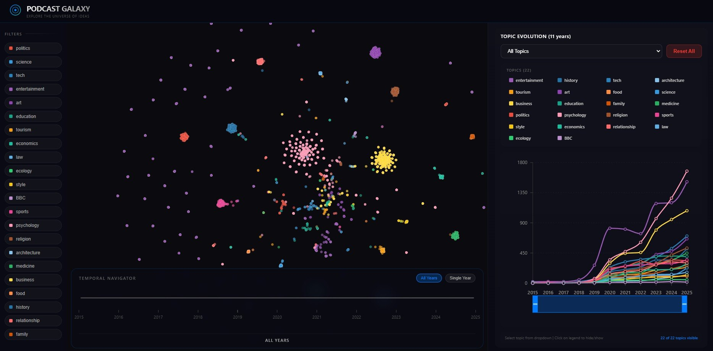
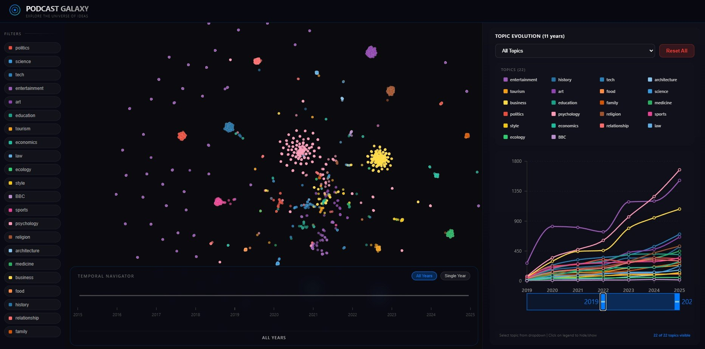

# Podcast Galaxy: Interactive Semantic Map of Podcast Episodes

## Link to our product
https://podcast-galaxy-1.onrender.com

## Project Overview
Podcast Galaxy is an interactive system for exploring large podcast collections through semantic visualization.  
The project collects podcast and episode metadata, classifies episodes into thematic categories, projects them into a 2D semantic space, and displays them on an interactive map with timeline and topic analytics. The data is represented by a sample derived from the initial population of 1.1 million episodes from 35,000 Russian podcasts from Yandex.Music.

The main goal is to help users see how Russian podcast content is distributed across themes, how topics evolve over time, and how individual episodes relate to each other inside a shared semantic space within a timeline from 2015 to 2025.

## Website appearance






## Features
- Interactive semantic map of podcast episodes
- Topic-based episode exploration
- Timeline navigation by year
- Hover cards with episode details and top topics
- Topic evolution chart across years
- Filtering by dominant topic

## Dataset Sources
1. **Yandex Music**
   - Podcast album metadata
   - Episode titles
   - Episode descriptions
   - Episode publication dates
   - Episode durations

2. **LLM classification pipeline**
   - Multi-topic classification scores for each episode
   - Dominant topic extraction
   - Cleaned structured topic distributions for downstream processing

3. **Derived semantic embeddings**
   - 2D UMAP coordinates
   - Dominant topic weights

## Topic Classification

The semantic map is structured around a fixed thematic taxonomy. The entire system from LLM classification to UI filters is constrained to the following **22 core topics**:

`politics` `science` `tech` `entertainment` `art` `education` `tourism` `economics` `law` `ecology` `style` `BBC` `sports` `psychology` `religion` `architecture` `medicine` `business` `food` `history` `relationship` `family`

## Technical Architecture
1. **Data Collection**
   - `backend/parser/id_albums.py` collects Yandex Music album ids by category
   - `backend/parser/main.py` imports podcasts and episodes into the backend API using API of Yandex.Music

2. **Data Processing**
   - `backend/database/preprocessing.py` filters low-quality episode records
   - `llm-processing/main_execution/llm.py` classifies episodes into topic distributions through DeepSeek API
   - `llm-processing/embeddings/embeddings_to_coordinates.py` builds 2D UMAP coordinates
   - `backend/database/import_episode_map_points.py` imports semantic map points into PostgreSQL

3. **Backend**
   - FastAPI REST API
   - SQLAlchemy async database access
   - PostgreSQL storage
   - Endpoints for podcasts, episodes, map points, hover details, timeline views, and year-topic statistics

4. **Frontend**
   - React + TypeScript + Vite
   - deck.gl scatterplot rendering for the semantic map
   - Recharts topic evolution chart
   - Timeline and year slider controls
   - Topic filters and episode detail overlays

## Semantic Map Pipeline
1. Fetch podcast album ids from Yandex Music categories
2. Import podcast and episode metadata into the backend
3. Clean and validate episode records
4. Derive a representative high-quality sample from the data
5. Run LLM-based topic classification
6. Convert topic distributions into 2D coordinates with UMAP
7. Import map points into the database
8. Visualize episodes as an interactive semantic galaxy in the frontend

## Repository Structure
```text
Podcast-Galaxy/
|-- backend/
|   |-- classifier/           # zero-shot classification experiments
|   |-- database/             # FastAPI app, models, DAL, import scripts
|   `-- parser/               # Yandex.Music collection and import scripts
|-- frontend/                 # React + deck.gl visualization + interactive interface
|-- llm-processing/           # LLM classification and embedding pipeline
|-- data/                     # local csv data files
|-- docker-compose.yml
`-- README.md
```

## Getting Started
### 1. Clone the repository
```bash
git clone <repository-url>
cd Podcast-Galaxy
```

### 2. Create environment files
Use `.env.example` as a base for your root `.env`.

Required values depend on your workflow, but in practice the project expects:
- PostgreSQL credentials
- `REAL_DATABASE_URL`
- optional DeepSeek API key for the LLM classification pipeline

Example:
```bash
cp .env.example .env
```


### 3. Run with Docker
Build everything:
```bash
docker-compose build
```

Start all services:
```bash
docker-compose up
```

### 4. Run locally without Docker
Backend:
```bash
cd backend
pip install -r requirements.txt
uvicorn database.endpoints:app --reload
```

Frontend:
```bash
cd frontend
npm install
npm run dev
```

## Frontend Experience
The frontend provides:
- a semantic map of episodes
- a year slider for temporal filtering of the map
- topic filters in the sidebar
- a topic evolution chart across years for each topic with interactive interface
- interactive hover and click states for episode inspection

## Contributors
- Maria Karpova
- Georgij Pyanov
- Daria Potapova (somehow she is not represented in the contributors section on GitHub, but there are plenty on commints from her)